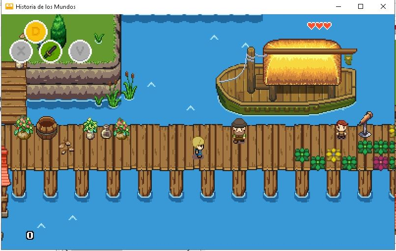

# La Historia de los Mundos
## Encendiendo las luces en lugares difíciles de llegar

<nav class="navbar navbar-expand-lg navbar-light bg-light">
  <a class="navbar-brand" href="#">Indice</a>

  

    <ul class="navbar-nav mr-auto">
      <li class="nav-item active">
        <a class="nav-link" href="#">Sobre este juego </a>
      </li>
      <li class="nav-item active">
        <a class="nav-link" href="#bitleaf">Ministerio bitLeaf</a>
      </li>
      <li class="nav-item">
        <a class="nav-link" href="#piloto">Descarga la versión piloto v1.0 (pronto)</a>
      </li>
     <li class="nav-item">
        <a class="nav-link" href="#encuesta">Ayúdanos realizando una encuesta</a>
      </li>
     <li class="nav-item">
        <a class="nav-link" href="#escribenos">Escríbenos</a>
      </li>
      <li class="nav-item">
        <a class="nav-link" href="#donacion">Donación</a>
      </li>

    </ul>

  

</nav>

Bienvenido a este interesante proyecto misionero. Una serie de estudios Bíblicos en un formato de video juego tipo Aventura-RPG, .
La finalidad de este video juego es poder llevar de una manera fresca,  no tradicional, e interactiva, las verdades de la Biblia,el mensaje de Jesús, su sacrificio, su inminente regreso, el sábado de descanso, y los 10 mandamientos a las nuevas generaciones de Jóvenes. 

Soy un Adventista del Séptimo Día, y creo con todas mis fuerzas que debemos hablar sobre los 3 Ángeles, acerca del Juicio Investigador, de Daniel y Apocalpisis, y de la santificación de nuestro caracter. Hacer brillar todos los secretos y recompenzas que la biblia promete y revela, los misterios del cielo, del Árbol de la Vida, de la Inmortalidad, de los ángeles, de la revelacion de Jesús en la Historia, etc. Todo esto debe ser contado y explicado en este último tiempo,  y debemos revelar a todas las personas como obtener la salvación y el perdón de pecados, y la importancia de conocer a Jesús. En esta última etapa de la historia, cuando este mundo de maldad está a punto de terminar con la venida del Señor, es más que nunca que debemos contar todos los secretos que están abiertos ante los hombres, para motivarlos a aceptar y Amar a Jesús, a arrepentirse y anhelar la salvación en Jesús.

Este tipo de formato puede llegar a los jóvenes ahí donde están, en medio de las ciudades, en los lugares más reconditos, ahí donde los misioneros no podrían llegar de otra forma, y en donde los prejuicios impedirían la entrada. 

## Lo que este juego no mostrará

Los juegos de este tipo son muy carismaticos, y sus personajes e historia pueden realmente quedar en la mente de los jugadores para siempre. Tanto el arte gráfico, como la música suelen ser de gran calidad y exquisitos en colores y melodías.  Generalmente los que gustan de estos juegos pueden pasar horas y horas, con todo el perjuicio que eso conlleva tanto físico como intelectual.

Además, estos juegos contienen una gran cantidad de elementos prohibidos por Dios, altamente dañinos para los cristianos y no cristianos del mundo,  elementos que por lo general lamentablemente le dan el exito y popularidad, pero que son las bases mismas de la inmoralidad y pecados que predominan en el mundo de hoy. Transmiten muchos mensajes subliminales, tantos explicitos como ocultos, y fomentan el menosprecio incluso el odio hacia el Dios de la Biblia.

A continuación indicaré que elementos nunca se tratarán en estos cursos interactivos, elementos que como Adventistas del Séptimo Día, sabemos que no debemos ni siquiera ver con nuestros ojos, ya que suelen ser muy seductores y exitantes. 

La Historia de los Mundos, no contendrá:

  - Brujería, magia, adivinación, referencias a otros dioses, etc.
  - Violencias, asesinatos, golpes, etc.
  - Burlas, menosprecio, orgullo o ambición.
  - Adulterio, desnudos, semi-desnudos, erotismo, sexo, palabras sugerentes,  etc.
  - Homosexualismo, lesbianismo, etc.
  - Robos, mentiras, envidia, etc.
  - Competencia, rivalidad, etc.

## Lo que este juego SI mostrará

Muchos se preguntarán, ¿que mostrará el juego para que sea atractivo entonces?, si no se va a mostrar lo que por lo general le da vida a los juegos. Bueno, hay mucho que mostrar. De hecho, los RPG están llenos de elementos robados de la Biblia y de lo que Dios quiere enseñar, tales como el Árbol de la Vida, la inmortalidad, poderes y milagros, ángeles, piedras preciosas, canciones, iglesias, etc. Dios también es el Dios de las ciencias, de la bella música, del color, de la vida, de la naturaleza, de la energía, de la fuerzas del universo, de la física, de la historia, de la biología etc. Por tanto hay mucho que se puede utilizar para motivar al Jugador a ser un verdadero hijo de Dios.

La Historia de los Mundos, contendrá:

  - Bella música, suave, melodiosa, elevadora. Creada y consagrada para Dios.
  - Naturaleza por todos lados, agricultura, ecología, permacultura, etc.
  - Ciencia, tecnologías energéticas conocidas y no conocidas (como cristales o minerales)
  - Futurismo, como naves voladoras, teletransportadores, etc.
  - Viaje al pasado Bíblico e historico (Noé, Daniel, Nimrod, etc)
  - Un mundo virtual, aparejado en un ambiente natural y tranquilo.
  - Temas referentes a las realidades actuales de la Verdad Presente.
  - Temas referentes a la reforma de la Salud (Reforma Pro Salud)
  - Temas referentes a la verdadera educación
  - Temas referente al Santuario y la interseción de Jesús.
  
<A NAME="piloto">
## VERSION PILOTO

Muy pronto estará disponible la primera versión de este juego. Esta contendrá solo unos minutos, del primer capítulo. Esto permitirá a mucha gente darse una idea de este proyecto misionero, cuya finalizdad es dar a conocer el evangelio pero en un formato fresco y diferente. 

<A NAME="encuesta">
## ENCUESTA

Queremos saber qué opinas de este formato. Es voluntario y anónimo. Nos ayudarías mucho si lo respondieras.

<a class="nav-link" href="https://bitleaf.wufoo.com/forms/la-historia-de-los-mundos/ ">https://bitleaf.wufoo.com/forms/la-historia-de-los-mundos/ </a>

<A NAME="escribenos">
## ESCRÍBENOS

¿Qué te parece este proyecto? ¿Tienes alguna obseración?, ¿una crítica? ¿O quieres saber más de la Biblia, y su increible historia y conocer más del buen Jesús?, anímate a escribirnos. 

bitleaf@protonmail.com

## ALGUNOS SCREENSHOTS

